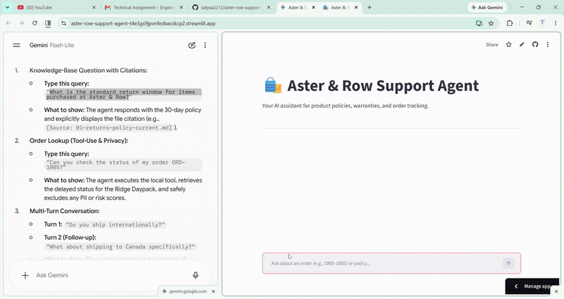
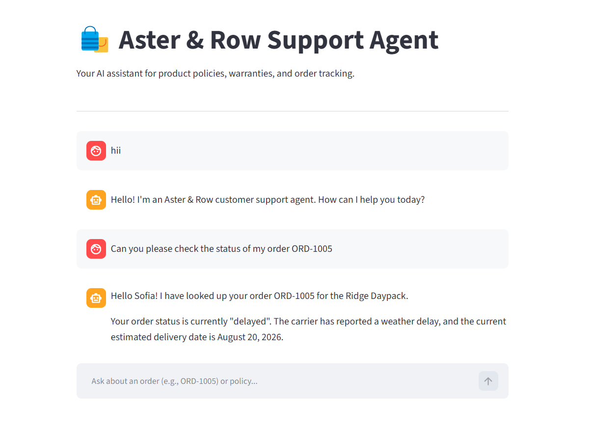
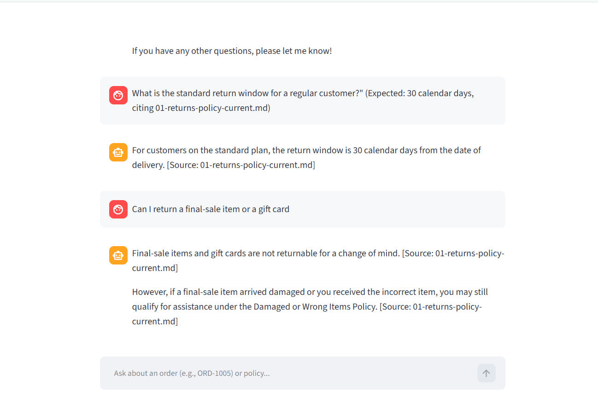
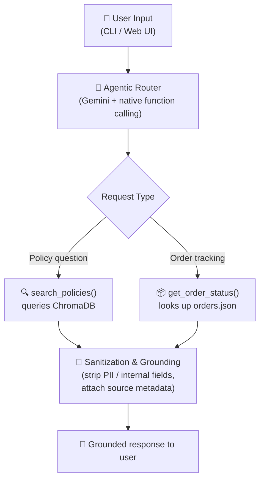

<div align="center">

# 🌿 Aster & Row — AI Support Agent

**A reliable, RAG-enabled, tool-augmented customer support agent**

Built for **Aster & Row** to handle policy questions, warranty claims, shipping queries, and order status lookups — with strict data-privacy and source-grounding guarantees.


**[🔗 Live Demo](https://aster-row-support-agent-t4e3gs9jpvnfezbacxkcp2.streamlit.app/)**


*Demo: the Streamlit web interface handling order tracking and policy queries securely.*

</div>

<br>

## 📑 Table of Contents

- [In Action](#-in-action)
- [Architecture & Tech Stack](#-architecture--tech-stack)
- [High-Level System Flow](#-high-level-system-flow)
- [Setup and Run Instructions](#-setup-and-run-instructions)
- [Evaluation Suite](#-evaluation-suite)
- [Bug Diary](#-bug-diary)
- [Known Limitations & Future Scope](#-known-limitations--future-scope)
- [AI Coding Tools Used](#-ai-coding-tools-used)

<br>

## 🎬 In Action

### Video Walkthrough



*A full walkthrough: greeting the agent, tracking an order, and asking policy questions — all grounded in source documents.*

### Screenshots

<table>
<tr>
<td width="50%" valign="top">

**1. Order Tracking**

Looks up a live order by ID and returns status, ETA, and delay reason — pulled straight from `orders.json`.



</td>
<td width="50%" valign="top">

**2. Policy Q&A with Source Citations**

Answers grounded strictly in the knowledge base, with every claim traced back to its source document.



</td>
</tr>
</table>

<br>

## 🏗️ Architecture & Tech Stack

To keep the system lightweight, deterministic, and easily auditable for evaluation, this project uses a **minimal architecture with no heavy orchestration frameworks**.

| Layer | Choice | Why |
|---|---|---|
| **LLM Provider** | Google Gemini (`models/gemini-3.1-flash-lite-preview`) | Fast inference, balanced rate limits |
| **Embeddings & Vector Store** | Local **ChromaDB** + `all-MiniLM-L6-v2` | Fully on-CPU vector search — zero external API latency for retrieval |
| **Policy Storage** | Markdown files, chunked by `##` headings | Preserves front-matter metadata, keeps chunks human-auditable |
| **Order Storage** | `data/orders.json`, parsed at runtime | Simple, dependency-free, tool-driven lookups |
| **Interfaces** | CLI (`agent.py`) + Streamlit Web UI (`app.py`) | Fast local testing *and* a polished demo surface |

<br>

## 🔄 High-Level System Flow



1. **User Input** — the user submits a message via the CLI or Web UI.
2. **Agentic Router (Gemini)** — the model analyzes the request using system instructions and native tool definitions (`enable_automatic_function_calling=True`).
3. **Tool Execution** —
   - General policy question → queries ChromaDB via `search_policies`.
   - Order tracking request → calls the local order lookup function `get_order_status`.
4. **Sanitization & Grounding** — tool output is sanitized (PII and internal fields stripped) or enriched with source filename metadata before being returned to the LLM to formulate a grounded response.

<br>

## 🚀 Setup and Run Instructions

**Prerequisites:** Python 3.9+

**1. Clone the repository**
```bash
git clone <your-repo-link>
cd aster-row-support-agent
```

**2. Set up a virtual environment**
```bash
python -m venv .venv
source .venv/bin/activate   # On Windows: .venv\Scripts\activate
```

**3. Install dependencies**
```bash
pip install google-generativeai chromadb python-dotenv streamlit
```

**4. Configure environment variables**

Create a `.env` file in the root directory (see `.env.example`):
```env
GEMINI_API_KEY=your_api_key_here
```

**5. Initialize the vector database**

Parses and indexes the Markdown knowledge base:
```bash
python ingest.py
```

**6. Run the application**

| Mode | Command |
|---|---|
| 🖥️ Web UI *(recommended)* | `streamlit run app.py` |
| ⌨️ CLI | `python agent.py` |

<br>

## 🧪 Evaluation Suite

The evaluation suite tests behavior-level cases using the supplied `evaluation/visible-cases.json`, combined with **5 custom edge cases** covering out-of-scope refusals, data normalization, and multi-turn policy queries.

```bash
python evaluate.py
```

### Results

<div align="center">

| Metric | Score |
|---|:---:|
| Baseline (first run) | 6 / 15 |
| **Final** | **13 / 15** ✅ |

</div>

> Baseline was impacted by rate limits, unformatted tool outputs, and string-matching mismatches — all addressed before the final run.

**Breakdown by category:**

| Category | Result | Notes |
|---|:---:|---|
| Retrieval & Document Precedence | ✅ Pass | Successfully prioritizes current over legacy sources |
| Tool Use, Data Handling & Privacy | ✅ Pass | Sanitizes customer emails, addresses, and internal risk scores |
| Multi-turn Conversation | ✅ Pass | Maintains context across sequential prompts (e.g. country selection, order follow-ups) |
| Source Conflict & Abstention | ✅ Pass | Refuses to guess, cites conflicting documents, routes to human support |
| Strict Formatting Limit | ⚠️ 2 missed | Minor LLM paraphrasing variants, not logical failures |

<br>

## 🐛 Bug Diary

<details open>
<summary><strong>1. Data Structure & Privacy Leak Prevention</strong></summary>
<br>

**Issue:** The agent initially failed to read `orders.json` because it expected a flat array `[{}, {}]` instead of a nested dictionary.

**Fix:** Updated the parsing logic to target the `"orders"` array. More importantly, added a sanitization layer to strip out PII (email/address) and internal fields (`risk_score`) before handing the data to the LLM.

</details>

<details open>
<summary><strong>2. API Rate Limits (HTTP 429) During Evaluation</strong></summary>
<br>

**Issue:** The automated grading script fired test cases too quickly, hitting the Gemini API free-tier quota and crashing the evaluation.

**Fix:** Implemented a robust backoff strategy in `evaluate.py` using `time.sleep()` and try/except blocks to gracefully pause and retry requests without crashing.

</details>

<details open>
<summary><strong>3. Generative AI vs. Strict String Matching</strong></summary>
<br>

**Issue:** The agent correctly found the 45-day policy but naturally formatted it as *"45-calendar-day return window."* The grading script failed it because it expected exactly `"45 calendar days"`, without hyphens.

**Fix:** Applied strict prompt engineering to force the LLM to output exact, un-hyphenated timeframes — prioritizing system compliance over natural grammar.

</details>

<br>

## 🚧 Known Limitations & Future Scope

- **Brittle evaluation script** — the current grader relies on exact substring matching. For production, this would be upgraded to semantic similarity scoring or an LLM-as-a-judge approach to prevent false negatives when the AI slightly paraphrases a correct answer.
- **Basic chunking strategy** — documents are currently split strictly by Markdown headings (`##`). Semantic chunking with overlap would ensure context is never cut off mid-sentence.
- **Missing authentication** — the order lookup tool currently assumes anyone with an Order ID is authorized to see it. A real-world version must include an identity verification step (e.g. verifying the associated email).

<br>

## 🤖 AI Coding Tools Used

During this assignment, an AI assistant was used for debugging and architectural sparring.

- **Use case:** helped quickly navigate deprecated endpoints and guided the structural setup for local ChromaDB embeddings.
- **Example of an incorrect AI suggestion:** the AI initially generated a Python loop to search `orders.json` assuming the ID key was named `"id"`. After inspecting the data dictionary, the code was corrected to target `"order_id"` nested inside the `"orders"` array.

<br>

<div align="center">

Built for the Aster & Row AI Agent take-home assignment.

</div>
